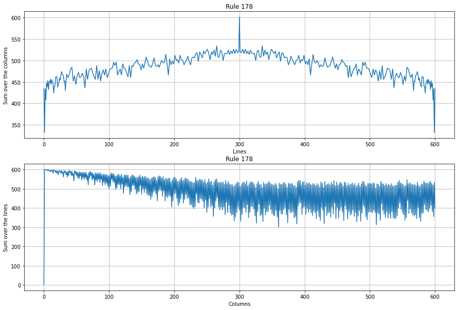

# 1-D-Pyramidal-cellular-automaton
A self python implemention of this 1 dimensional cellular automaton

This implementation take into account only the two nearest neighboors. This lead to the fact that there are 256 set of rules.

All of the 256 rules were implemented. To not having an overloaded file, the rules are distributed in 3 files.

The list of script and their purpose:
* automata.py:
  * ApplicationRules: Function to applied one of the 256 possible rules.
    
* rules0_99.py, rules100_199.py, rules200_255.py:
  * contains the 256 different rules that can be applied.
 
* embedding_func.py:
  * recadre_pyr: embedding function.

Here are some exemple of what you can have with different rules.

